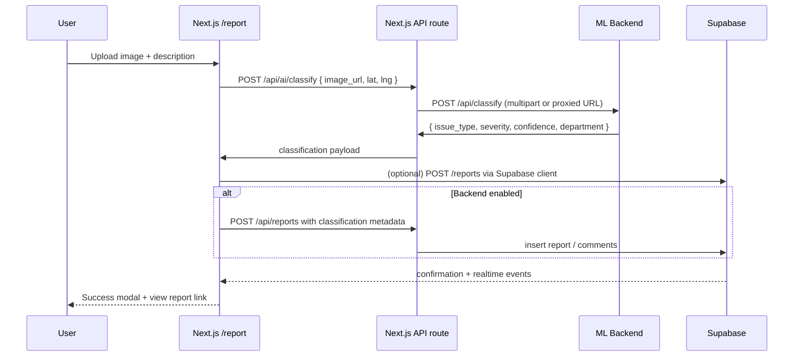

# CityLens System Architecture

## 1. Overview

CityLens is a polyglot system with three primary services:

1. **Next.js Frontend** – App Router UI, API routes for proxying uploads and AI calls, Supabase client-side subscriptions, MapLibre map rendering, Comet Browser enhancements.
2. **FastAPI Backend** – REST endpoints for reports, analytics, and admin operations; image processing; department routing; priority scoring; Supabase persistence.
3. **ML Backend** – Dedicated FastAPI service that speaks to OpenAI GPT‑4 Vision (or mocked classifiers) and produces structured classifications, costs, and routing hints.

Supporting services include Supabase PostgreSQL (auth, realtime, storage), optional Supabase Storage/Cloudinary for media, and OpenAI for computer-vision inference.

## 2. Component Diagram

```
                                    ┌───────────────────────────┐
                                    │         USER              │
                                    │ • Uploads Image           │
                                    │ • Enters Description      │
                                    │ • Views Map / Admin       │
                                    │ • Uses AI Chat            │
                                    └───────────┬───────────────┘
                                                │
                                                ▼
                           ┌─────────────────────────────────────────┐
                           │          NEXT.JS FRONTEND               │
                           │  • UI Pages (Report, Map, Admin)        │
                           │  • Tailwind + MapLibre                  │
                           │  • Supabase Realtime Subscriptions      │
                           └───────────┬───────────────┬────────────┘
                                       │               │
                                       │               ▼
                                       │     ┌─────────────────────┐
                                       │     │ NEXT.JS API ROUTES  │
                                       │     │ • /api/reports      │
                                       │     │ • /api/ai/classify  │
                                       │     │ • /api/uploads      │
                                       │     └───────────┬─────────┘
                                       │                 │
                                       ▼                 ▼
                   ┌───────────────────────────┐    ┌───────────────────────────┐
                   │     IMAGE PROCESSOR       │    │       ML BACKEND          │
                   │  • Resize / Optimize      │    │   (FASTAPI SERVICE)       │
                   │  • Extract Metadata       │    │ • Receives image          │
                   └───────────┬──────────────┘    │ • Calls GPT-4 Vision       │
                               │                   │ • Generates classification  │
                               ▼                   └───────────┬────────────────┘
                   ┌───────────────────────────┐               │
                   │  IMAGE STORAGE LAYER      │               ▼
                   │ • Supabase Storage        │    ┌───────────────────────────┐
                   │ • Base64 Fallback         │    │     GPT-4 VISION API      │
                   └───────────┬──────────────┘    │  • Issue type              │
                               │                   │  • Severity                 │
                               │                   │  • Confidence               │
                               │                   └───────────┬────────────────┘
                               │                               │
                               ▼                               ▼
                     ┌───────────────────────────┐   ┌──────────────────────────┐
                     │     FASTAPI BACKEND       │<──┤ ML BACKEND RESPONSE      │
                     │ • /api/reports            │   │ (classification JSON)    │
                     │ • /api/admin              │   └──────────────────────────┘
                     │ • /api/comments           │
                     │ • /api/analytics          │
                     │                           │
                     │ SERVICES:                 │
                     │  • Priority Scorer        │
                     │  • Department Router      │
                     │  • Recurrence Analyzer    │
                     └───────────┬──────────────┘
                                 │
                                 ▼
                    ┌──────────────────────────────────────┐
                    │             SUPABASE                  │
                    │  PostgreSQL Database                 │
                    │   • Reports                          │
                    │   • Users                            │
                    │   • Comments                         │
                    │   • Departments                      │
                    │                                      │
                    │  AUTH: JWT Tokens                    │
                    │  REALTIME: Live Subscriptions        │
                    │  STORAGE: Image Buckets              │
                    └───────────┬──────────────┬───────────┘
                                 │              │
                                 │              ▼
                                 │   ┌──────────────────────────┐
                                 │   │ NEXT.JS FRONTEND (RT)    │
                                 │   │ • Live updates           │
                                 │   │ • Admin queue refresh    │
                                 │   └────────────┬────────────┘
                                 │                │
                                 └────────────────▼
                                    ┌─────────────────────────┐
                                    │         USER            │
                                    │  Sees:                  │
                                    │  • Confirmation          │
                                    │  • Map updates           │
                                    │  • Leaderboards          │
                                    │  • Admin state changes   │
                                    └─────────────────────────┘
```

## 3. Service Responsibilities

### 3.1 Next.js Frontend

- Pages: `/`, `/report`, `/map`, `/leaderboard`, `/my-reports`, `/admin`, `/ai-chat`.
- UI Framework: Tailwind, Shadcn/ui, Framer Motion, MapLibre GL, React CountUp, Recharts.
- Data fetching:
  - Direct Supabase client for realtime subscriptions (my reports, admin queue).
  - Internal API routes (`/api/reports`, `/api/ai/classify`, `/api/reports/upload-image`) as fallbacks to local memory when Supabase isn’t configured.
- Comet Browser detection: banner, anonymous mode, blockchain badge, Comet-specific features page.
- AI chat overlay uses `fetch('/api/ai/classify')`, receives structured JSON (issue_type, severity, confidence, priority, department, cost).

### 3.2 FastAPI Backend

- Routes inside `app/api/routes.py`:
  - `POST /api/reports` – accepts report payload, runs AI classification (if available), stores in Supabase/memory, returns normalized response.
  - `GET /api/reports`, `GET /api/reports/{id}` – listing and detail (with comments, nearby reports).
  - `PATCH /api/reports/{id}` – admin status updates.
  - `POST /api/reports/{id}/comments` – comments with Supabase Auth enforcement.
  - `GET /api/leaderboard`, `GET /api/departments`, `GET /api/analytics/summary`.
  - `POST /api/reports/upload-image` – handles uploads (Supabase Storage or local base64 fallback).
- Services:
  - `ai_classifier.py` – wraps OpenAI GPT‑4 Vision responses, caches client, includes fallback classification.
  - `priority_scorer.py` – calculates 0-100 score based on severity, safety, environmental impact, recurrence (currently mocked when Supabase queries unavailable).
  - `department_router.py` – maps issue types and districts to municipal departments (static directory fallback).
  - `image_processor.py` – optimize/resize images, extract metadata, optional blur.
  - `image_storage.py` – tries Supabase Storage; falls back to local base64 data URLs.
- Middleware: CORS, SlowAPI rate limiting (using `Limiter` + `SlowAPIMiddleware`).

### 3.3 ML Backend

- FastAPI service (separate repo folder) with `/api/classify`.
- `UrbanIssueClassifier` (mock) + `DepartmentRouter` for deterministic responses when GPT‑4 Vision is unavailable.
- Production mode sets `OPENAI_API_KEY` and `OPENAI_VISION_MODEL`; the backend fetches the uploaded image, sends it to OpenAI via `responses.create`, and returns structured JSON.
- Department assignment returned to the frontend, so the UI shows the actual municipal contact.

## 4. Data Flow

### 4.1 Report Submission



### 4.2 Map + Admin Realtime

- Next.js subscribes to Supabase channels for `reports` table updates.
- Admin dashboard uses Supabase Realtime to update queues and cards without page refresh.
- Map page fetches aggregated data through Next.js API routes or directly from Supabase (depending on config).

## 5. Environments

| Environment | Notes |
| --- | --- |
| Local | ML backend + Next.js required; FastAPI REST optional if Supabase is not configured (Next.js in-memory store suffices). |
| Staging | Deploy ML backend behind auth; front/back talk over HTTPS. |
| Production | GPT‑4 Vision at scale, Supabase Postgres for persistence, Supabase Storage for media (Cloudinary removed per latest requirements). |

## 6. Error Handling & Resilience

- AI classification has retry logic (3 attempts) and falls back to “unclear_issue” with user-friendly messaging.
- Image uploads degrade gracefully to base64 data URLs when Supabase Storage is missing.
- Supabase dependencies now default to static directory or zeroed recurrence scores to keep FastAPI running locally.
- Next.js API routes wrap all fetches with try/catch and surface descriptive errors to the UI (Alert components, toaster-style banners).

## 7. Observability & Future Work

- Logging: FastAPI uses `loguru`; ML backend logs success/failure attempts and raw responses.
- TODO (see `PROJECT_CLEANUP_REPORT.md`):
  - Harden ESLint/TypeScript rules (remove `any`s, fix Next.js plugin warning).
  - Automate ML backend health checks in CI.
  - Add metrics (Prometheus/OpenTelemetry) for classification latency, Supabase query times.
  - Deploy WebSocket endpoints for realtime admin command center (optional).

---

For detailed UX flows, refer to `USERFLOW.md`. For deployment and setup instructions, see `README.md` and `SETUP.md`.

