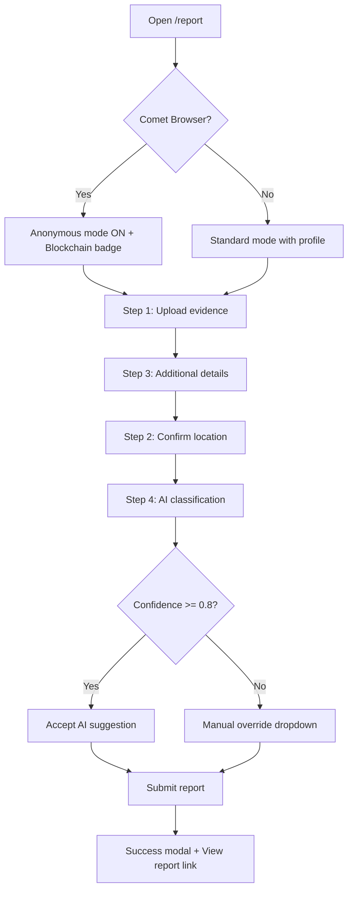
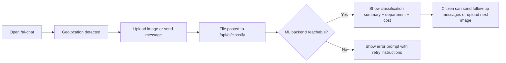
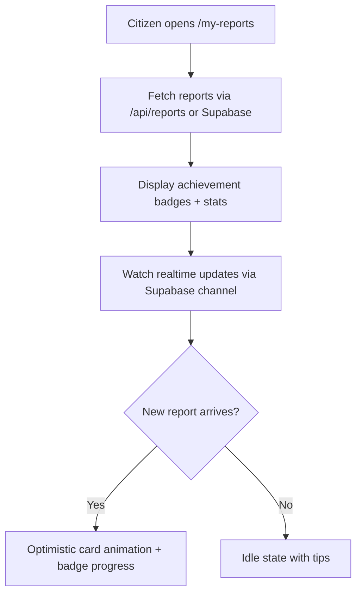
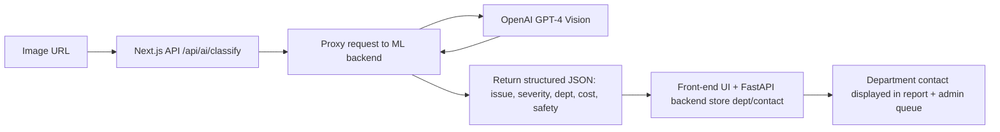

# CityLens User Flows

This document describes the primary user journeys through CityLens and includes flowcharts for clarity.

---

## 1. Citizen – Report Submission Flow



### Detailed Steps

1. **Landing on `/report`:** Citizen sees Comet banner + privacy toggle. If the browser is identified as Comet, anonymous mode and blockchain badge are enabled automatically.
2. **Step 1 – Upload Evidence:** Drag-and-drop or camera capture. Images auto-compress and upload either to Supabase Storage or fallback base64.
3. **Step 3 – Additional Details:** Describe the hazard, choose anonymous mode (non-Comet), auto-filled classification details after AI run.
4. **Step 2 – Confirm Location:** GPS auto-detect + draggable MapLibre mini-map + reverse geocoding.
5. **Step 4 – AI Classification:** GPT‑4 Vision returns issue type, severity, department, priority score. If confidence < 0.8, the citizen can override manually.
6. **Submission:** Report stored via Supabase/Next.js API, confetti + CTA to view report, with optional “View last report” button.

---

## 2. Citizen – AI Assistant Chat Flow



Key details:

- Real-time streaming is simulated via optimistic AI responses.
- Classification results include priority emoji, severity, safety risk, cost, department, and recommended action.
- Users are nudged to upload photos if they only type text.

---

## 3. Map Explorer Flow

```mermaid
flowchart TD
  A[Open /map] --> B[Fetch reports (Supabase or API)]
  B --> C[Render filters + stats]
  C --> D[Display MapLibre map with clusters & heatmap toggle]
  D --> E{User applies filters?}
  E -->|Yes| F[Re-query + update visible markers]
  F --> D
  E -->|No| G[Show default viewport + live counters]
```

Highlights:

- Sidebar filters (issue type, status, priority, date range, search).
- Heatmap vs marker toggle, legend, stats ribbon, mobile swipe deck.
- Realtime updates via Supabase subscription trigger map refresh.

---

## 4. Admin Dashboard Flow

```mermaid
flowchart LR
  A[Admin visits /admin] --> B[Auth guard / middleware]
  B -->|Authorized| C[Load Supabase reports + realtime subscription]
  C --> D[Stats cards + priority queue + performance charts]
  D --> E{Admin updates status?}
  E -->|Yes| F[PATCH /api/reports/{id}]
  F --> C
  E -->|No| G[Monitor map, predictive analytics, export data]
```

Core actions:

- View high-priority queue, department performance, predictive insights.
- Export CSV/PDF (buttons call utility functions).
- Realtime updates keep queue fresh without refresh.

---

## 5. Leaderboard & My Reports Flow



- `/leaderboard` offers filters (week/month/all) with gamified reward ribbons.
- `/my-reports` shows achievements, 3D hover cards, anonymized avatars for Comet users.

---

## 6. AI Classification & Department Routing Flow



Fallbacks:

- If GPT‑4 Vision unreachable → deterministic mock classification + “City Operations” department.
- If Supabase storage missing → base64 storage + message to configure credentials.

---

## 7. Error & Retry Paths

- Missing GPS permission → default to Dubai coordinates with alert.
- Classification failure → fallback classification + warning banner.
- Upload failure → fallback to base64 + toast, user can retry.
- Rate limits (SlowAPI) → 429 with friendly messaging; UI handles by showing “Too many submissions, try again”.

---

## 8. Error Handling Flow (ASCII Map)

```
                                     ┌──────────────────────────────┐
                                     │        USER ACTION           │
                                     │ • Upload image               │
                                     │ • Submit report              │
                                     │ • Use AI chat                │
                                     │ • Enable location            │
                                     └───────────────┬──────────────┘
                                                     │
                                                     ▼
                          ┌────────────────────────────────────────────────┐
                          │       SYSTEM ATTEMPTS NORMAL OPERATION         │
                          │  • Read GPS                                     │
                          │  • Upload image                                 │
                          │  • Call GPT-4 Vision                            │
                          │  • Write to Supabase                            │
                          └───────────────┬─────────────────────────────────┘
                                          │
                                          ▼
                    ┌──────────────────────────────────────────┐
                    │          ANY ERROR OCCURS?               │
                    │  • GPS failure                           │
                    │  • Image upload error                    │
                    │  • ML backend down                       │
                    │  • GPT-4 Vision unreachable              │
                    │  • Supabase rate limit / connection      │
                    └──────────────┬───────────────────────────┘
                                   │ Yes
                                   ▼
     ┌────────────────────────────────────────────────────────────────────────┐
     │                           ERROR HANDLING                               │
     └───────────────────────────────────┬────────────────────────────────────┘
                                         │
                                         ▼
         ┌─────────────────────────────────────────────────────────────────┐
         │             1. GPS / Location Permission Failure               │
         │ • Browser denies geolocation                                   │
         │ • User skips location setup                                    │
         │ → Default to Dubai coordinates + warning banner                │
         └─────────────────────────────┬───────────────────────────────────┘
                                       │
                                       ▼
         ┌─────────────────────────────────────────────────────────────────┐
         │                     2. Image Upload Failure                     │
         │ • Supabase Storage unavailable / network interruption           │
         │ → Switch to base64 fallback, toast prompts retry                │
         └─────────────────────────────┬───────────────────────────────────┘
                                       │
                                       ▼
         ┌─────────────────────────────────────────────────────────────────┐
         │               3. AI / Classification Failure                   │
         │ • ML backend down or GPT-4 Vision timeout/quota                │
         │ → Deterministic fallback classification + “City Operations”    │
         │ → Warning banner + manual override allowed                     │
         └─────────────────────────────┬───────────────────────────────────┘
                                       │
                                       ▼
         ┌─────────────────────────────────────────────────────────────────┐
         │              4. Supabase DB / Rate Limit Errors                │
         │ • SlowAPI 429s or Supabase errors                              │
         │ → Message “Too many actions. Try again shortly.”               │
         │ → Retry button enabled after cooldown                          │
         └─────────────────────────────┬───────────────────────────────────┘
                                       │
                                       ▼
                        ┌───────────────────────────────────────────┐
                        │            RETRY OPTIONS                  │
                        │ • Retry action                            │
                        │ • Continue with fallback                  │
                        │ • Cancel and return                       │
                        └───────────────────────────┬──────────────┘
                                                    │
                                                    ▼
                              ┌──────────────────────────────────┐
                              │        FINAL OUTCOME             │
                              │ • Report submitted via fallback  │
                              │ • User guided by alerts          │
                              │ • System remains usable          │
                              └──────────────────────────────────┘
```

---

Refer to `SYSTEM_ARCHITECTURE.md` for the service topology and `README.md` for setup/deployment instructions.

